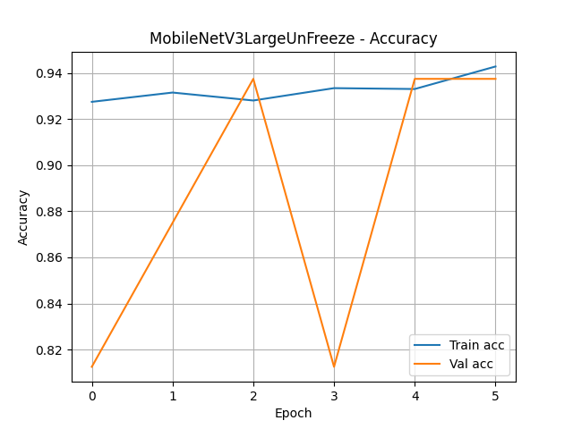
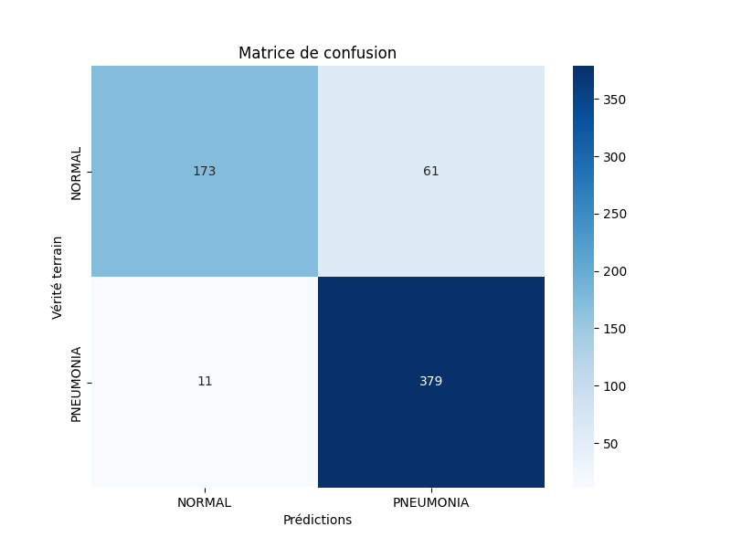
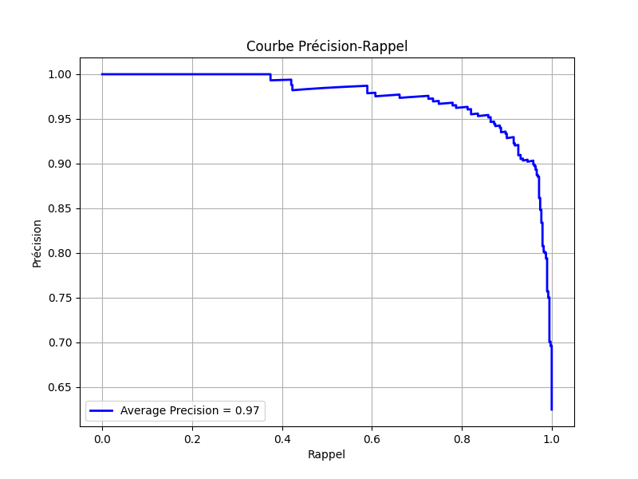

# Détection de Pneumonie à partir de Radios Thoraciques


# Contexte 
Ce projet utilise un modèle de vision par ordinateur pré-entraîné (CNN) pour mettre en place un système de classification binaire permettant de détecter des cas de pneumonie à partir de radios thoraciques. Le dataset utilisé est le **Chest X-Ray Pneumonia**.
> [Chest X-Ray Images (Pneumonia)](https://www.kaggle.com/datasets/paultimothymooney/chest-xray-pneumonia)
- **Licence du dataset :** CC BY 4.0 
  
Le modèle utilisé est **MobileNetV3Large**, finement ajusté à l’aide de **TensorFlow/Keras** et suivi avec **MLflow** pour la traçabilité des expériences.

## Sommaire
- [Détection de Pneumonie à partir de Radios Thoraciques](#détection-de-pneumonie-à-partir-de-radios-thoraciques)
- [Contexte](#contexte)
  - [Sommaire](#sommaire)
  - [Définition pneumonie](#définition-pneumonie)
  - [Objectifs](#objectifs)
  - [Données utilisées](#données-utilisées)
  - [Structure du projet](#structure-du-projet)
  - [Entraînement du modèle](#entraînement-du-modèle)
    - [Pourquoi MobileNetV3Large](#pourquoi-mobilenetv3large)
    - [Pré-requis et installation](#pré-requis-et-installation)
    - [Suivi des expériences avec MLflow](#suivi-des-expériences-avec-mlflow)
  - [Résultats](#résultats)
  - [Graphiques](#graphiques)
  - [Auteur](#auteur)
- [Licence](#licence)
---


## Définition pneumonie 

La pneumonie est une infection pulmonaire sérieuse qui peut être détectée sur des radiographies thoraciques. Ce projet vise à aider les professionnels de santé à accélérer le diagnostic grâce à l’intelligence artificielle.

--- 

## Objectifs

- Charger et prétraiter les données de radiographie.
- Utiliser **MobileNetV3Large** pour classer les images (Normal vs Pneumonia).
- Évaluer les performances du modèle.
- Suivre les expériences avec **MLflow**.

--- 

## Données utilisées

Le dataset est divisé en trois dossiers :
- `train/`
- `val/`
- `test/`

Chaque dossier contient deux sous-dossiers :
- `NORMAL/`
- `PNEUMONIA/`

---
## Structure du projet
Voici l'arborescence du projet pour mieux localiser certains fichiers : 

- **data/** : 
  - **train/** : 
    - **NORMAL/**: 
    - **PNEUMONIA/**: 
  - **test/** :
    - **NORMAL/**: 
    - **PNEUMONIA/**: 
  - **val/**:
    - **NORMAL/**:
    - **PNEUMONIA/**: 
- **graph/** : Dossier contenant les graphiques de la dernière expérience complétée, les autres se trouveront dans le dossier mlartifacts.
  - **accuracy.png** : 
  - **confuse_matrix.png**:
  - **finetune_accuracy.png**: 
  - **precision_recall_curve.png**: 
  - **roc_curve.png**:  
- **img** : Dossier contenant les bannieres du projet.
  - **banniere_readme.png**: Banniere du Readme.md.
  - **banniere.png**: Banniere du notebook jupyter .
- **mlruns/** : Dossier généré par Mlflow contenant les expérimentations, des sous-dossiers sont généré par chaque expérimentations.
- **mlartifacts/** :  Dossier généré par Mlflow contenant les artefacts(model, images etc...), des sous-dossiers sont généré par chaque expérimentations.
- **LICENCE** : Licence MIT du projet.
- **requirements.txt** : Dépendances pip requises pour l'utilsation du projet 
- **README.md** : Documentation du projet.
- **transfer_learning.ipynb** : Notebook jupyter du projet contenant des informations et le code . 

---

## Entraînement du modèle

Le modèle MobileNetV3Large a été entraîné sur les images redimensionnées à 224x224 avec :
- Fine-tuning des 20 dernières couches du modèle pré-entraîné sur ImageNet.
- Optimiseur : Adam
- Fonction de perte : Binary Crossentropy
- Early stopping 
  
### Pourquoi MobileNetV3Large 
Après avoir testé différents modèles en passant par efficientNetV2B0, DenseNet121 et MobileNetV3Small, j'ai choisi MobileNetV3Large qui est pour moi le meilleur compromis entre puissance et ressource surtout pour une configuration ou la carte graphique n'a pas pu être utilisé pour tensorflow.
 
---
### Pré-requis et installation 

1. **Cloner le projet** : Pour utiliser l'application, téléchargez le Zip du projet depuis GitHub en [cliquant ici](https://github.com/benjsant/wator_groupe1.git).

   Vous pouvez également exécuter la commande suivante si vous avez **Git** installé sur votre machine :

```bash
git clone https://github.com/benjsant/MlFlow_medical_screen_CNN.git
```

1. **Installer Python et les dépendances** : Assurez-vous d'avoir Python 3.10.10 installé sur votre machine, voici un lien pour le télécharger pour windows 10 juste [ici](https://www.python.org/ftp/python/3.10.10/python-3.10.10-amd64.exe)


Puis avec un terminal de commande, installez les dépendances nécessaires avec la commande ci-dessous ou vous pouvez installer les dépendances lorsque VS Code le demande:  

```bash
pip install -r requirements.txt
```

2. **Mise en route du programme** : Une fois toutes vos dépendances Python installées vous pouvez mettre en route le programme dans votre éditeur de code, je recommande VS Code. Veuillez choisir votre environnement python3.10.10 puis éxécuter toutes les cellules ou une à une, c'est votre choix 

---

### Suivi des expériences avec MLflow

MLflow permet de suivre :
- Les hyperparamètres
- Les métriques (accuracy, loss, etc.)
- Les modèles sauvegardés
- 
Vous pouvez simplement exécuter le programme, j'ai ajouté une option qui permet de lancer le serveur mlflow sans avoir besoin de l'exécuter au préalable, le défaut de cet option est que dès que nous quittons l'IDE MlFlow sera désactivé.

si vous voulez tout de même l'exécuter en terminal voici la commande ci-dessous: 
```bash
mlflow ui
```

---

## Résultats

Les performances obtenues sur le jeu de test :
- **Accuracy** : ~98%
- **Recall** : 99%
- **Precision** : 97%
- **F1-Score** : 98%

---

## Graphiques

Voici quelques graphiques illustrant les performances du modèle :
- **Accuracy :**

  

- **Matrice de confusion :**
  
  
- **Précision et Rappel :**
  
  
- **Courbe ROC :**
  
  

--- 

## Auteur

Projet réalisé par **[Benjamin](https://github.com/benjsant/)** dans le cadre d’un projet éducatif lors de la formation Développeur IA à Simplon Lille.

---

# Licence

Ce projet est sous licence MIT. Voir le fichier LICENSE pour plus d'informations.

Les poids pré-entraînés et le modèle original sont la propriété de leurs auteurs respectifs.
Merci de consulter les conditions d'utilisation spécifiques pour chacun.